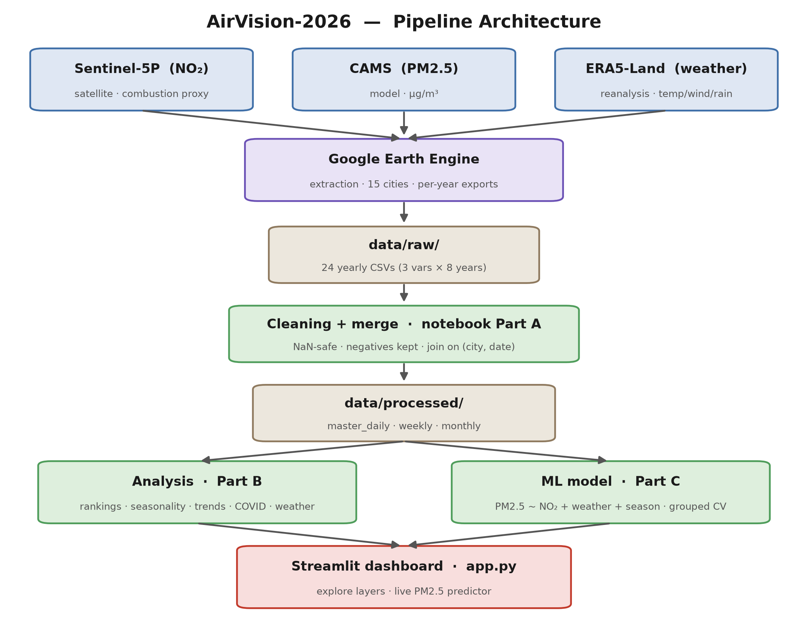
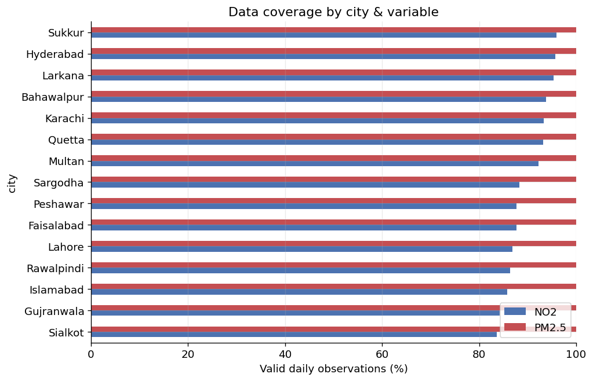
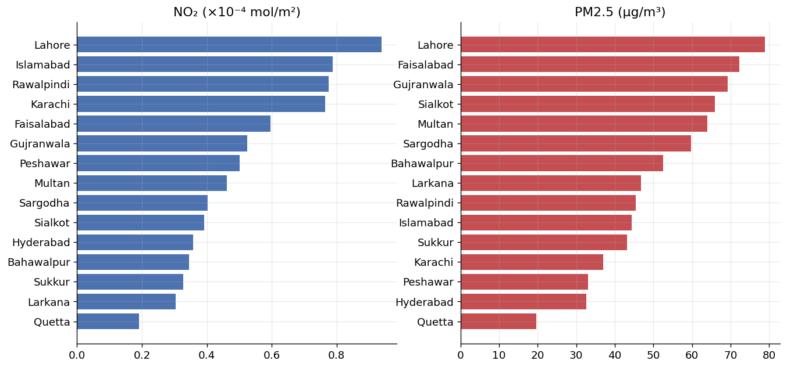
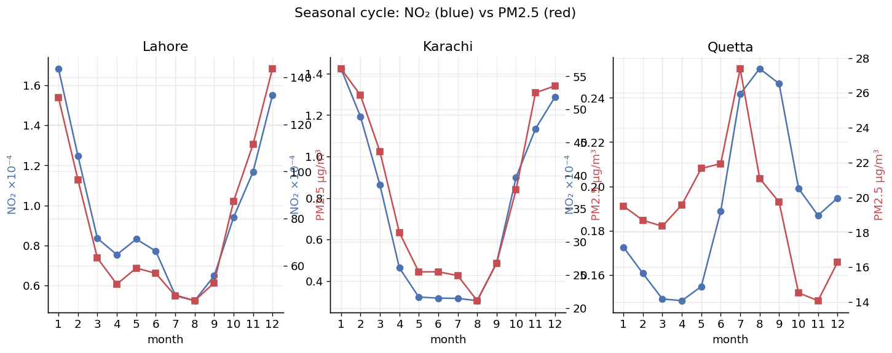
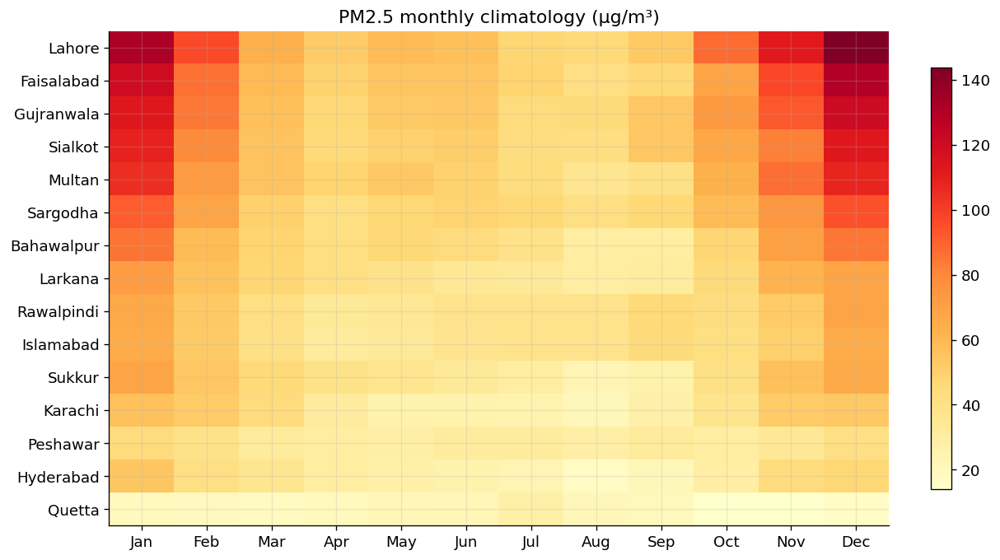
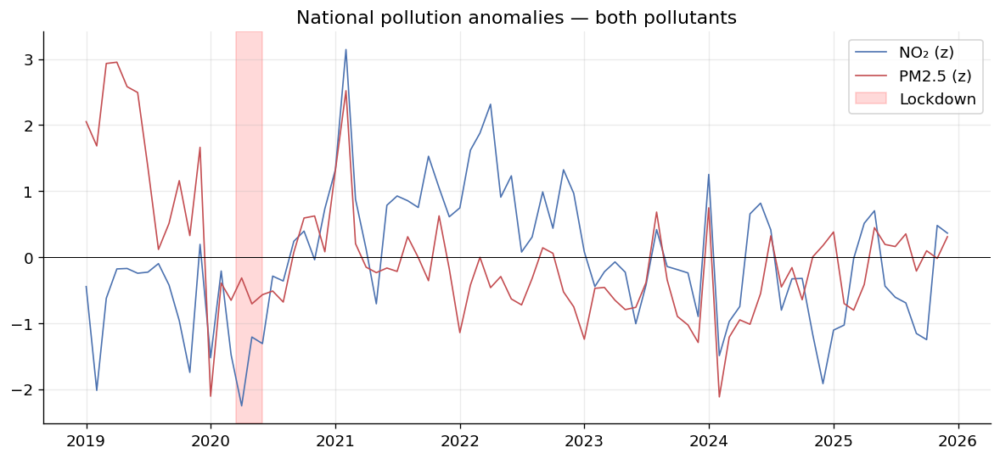
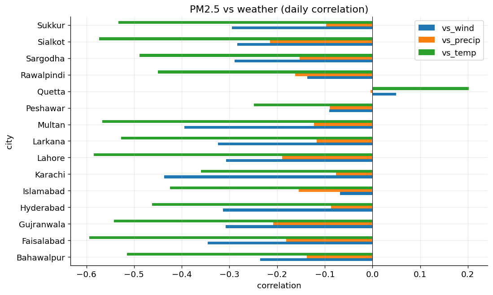
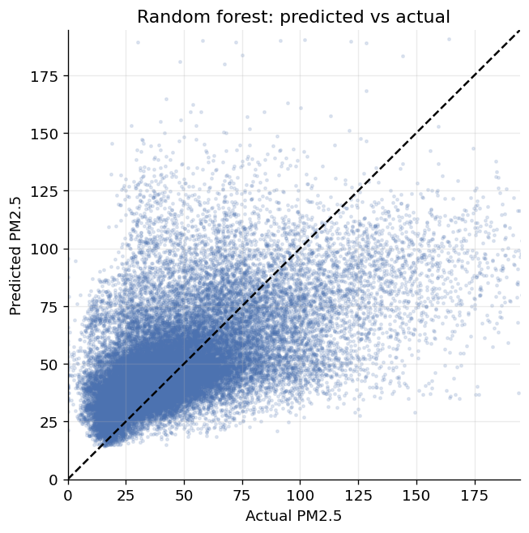
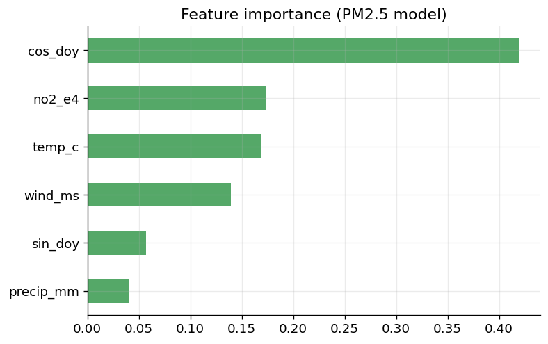

#  Air Pollution Across Pakistan, from Space

**A three-variable study of air quality over 15 Pakistani cities across seven complete years (2019–2025, plus a partial 2026), built entirely from satellite and reanalysis data — plus a machine-learning model and an interactive dashboard.**

> Pakistan ranks among the most polluted countries on Earth, and Lahore repeatedly tops the global list for the worst urban air during its winter smog season — yet the country has almost no public ground-monitoring network. This project fills that gap using openly available Earth-observation data, and goes beyond a single pollutant to study **how pollution behaves, where it comes from, and what disperses it.**

---

## Architecture



##  What this project does

| | |
|---|---|
| **Scope** | 15 cities · 2019–2025 complete (+ partial 2026) · daily resolution · ~40,000 city-days per variable |
| **Variables** | **NO₂** (Sentinel-5P, combustion proxy) · **PM2.5** (CAMS model, µg/m³) · **Weather** (ERA5-Land: temperature, wind, precipitation) |
| **Pipeline** | Earth Engine extraction → validated cleaning → merged master → analysis → ML model → dashboard |
| **Deliverables** | Reproducible notebook · processed datasets · trained model · Streamlit app |

This is deliberately a **multi-variable** project: a single pollutant is a chart, but three variables that interact tell a story — which is the difference between a demo and a study.

---

##  Key findings

1. **The two pollutants trace different geographies.** PM2.5's worst cities are a clean Punjab-industrial cluster — Lahore, Faisalabad, Gujranwala, Sialkot, Multan, Sargodha take the top six spots (a ~4× spread from Lahore to Quetta). NO₂'s worst cities are different: Lahore still tops the list, but it's followed by Islamabad, Rawalpindi, and Karachi — traffic/combustion hubs rather than industrial Punjab (a ~5× spread). **Quetta is lowest on both.** The two lists agree at the very top (Lahore leads both) but diverge below — and that divergence is itself a finding, not a footnote.

2. **NO₂ and PM2.5 only weakly agree across cities (Spearman ρ = 0.38, p = 0.16 — not significant at n=15), and the divergence is the real insight.** Karachi, Islamabad, and Rawalpindi rank 6–8 places higher on NO₂ than PM2.5 — substantial local combustion that doesn't translate into proportional particulate buildup, plausibly due to better dispersion (Karachi's coastal winds) or less dust/secondary-aerosol input. Larkana shows the reverse — low NO₂, comparatively higher PM2.5 — closer to a *transported/secondary particulate* signature. With only 15 cities, none of this should be read as a strong statistical pattern, but the city-level texture is something a single-pollutant project can't surface.

3. **Two pollutants, one seasonal engine.** Both peak in winter (temperature inversions + crop-residue burning trap emissions) and bottom out in the monsoon (rain scrubs the air).

4. **The 2020 COVID lockdown is visible in both pollutants** as a spring dip — two independent data sources agreeing strengthens the signal beyond what either shows alone.

5. **Weather drives dispersion — quantified, but modestly.** A model predicting PM2.5 from NO₂ + weather + season on *held-out cities* reaches R² = 0.31 (MAE ≈ ±19 µg/m³, random forest; linear regression alone is weaker at R² = 0.22). Its linear coefficients show wind measurably lowers PM2.5 (−5.4 µg/m³ per +1 SD) with a smaller precipitation effect (−0.2 µg/m³ per +1 SD), even with emissions held fixed — but in the random forest the **seasonal term (`cos_doy`) is the model's single strongest feature**, ahead of NO₂, temperature, and wind. Winter peaks are therefore best read as seasonality (trapped air *and* timing) rather than combustion alone.

>  **Honest framing:** NO₂ is a *measured* combustion proxy (not AQI); PM2.5 here is *modelled* output (CAMS, ~40 km), not a ground measurement; weather is reanalysis. Every claim is kept to what each data source can support.

---

##  Visualizations

#### Data coverage by city & variable
NO₂ (satellite) has real cloud/fog gaps; PM2.5 (model) and weather (reanalysis) are near-complete. NO₂'s gaps cluster on the foggiest winter days — the most polluted ones — so its winter peaks are, if anything, conservative.



#### City rankings — NO₂ vs PM2.5
The two pollutants agree at the very top — Lahore leads both — but diverge below, revealing local-combustion vs transported-particulate regimes.



#### Seasonal cycle — NO₂ (blue) vs PM2.5 (red)
Both pollutants share the winter-high / monsoon-low rhythm, confirming a common seasonal driver.



#### PM2.5 monthly climatology
The hazardous winter band and clean monsoon trough, city by city.



#### COVID-19 lockdown signal
Deseasonalised national anomalies for both pollutants, with the spring-2020 lockdown window shaded.



#### Pollution vs weather
Daily correlation of PM2.5 with wind, precipitation, and temperature across cities — the dispersion relationship.



#### Model performance & drivers
Random-forest PM2.5 predictions on held-out cities, and what the model leans on.




---

##  The model

A model predicting **PM2.5 from NO₂ + temperature + wind + precipitation + day-of-year**, validated with **GroupKFold grouped by city** — every fold tests on cities the model never trained on. This is intentionally strict: it stops the model from memorising a city's baseline and forces it to learn the *relationships*, so the reported skill generalises.

- **Validation:** grouped (leave-cities-out) 5-fold cross-validation
- **Headline metric:** cross-validated R² and MAE on entirely held-out cities
- **Dominant predictor:** the seasonal term (`cos_doy`, importance ≈0.42) is the single strongest feature; NO₂ (≈0.17) is a meaningful contributor but not dominant, because NO₂ is itself seasonal and part of its signal routes through the day-of-year term
- **Dispersion effect:** negative wind & precipitation coefficients quantify how much weather lowers PM2.5 with emissions held fixed

> *Associational, not causal* — the model quantifies relationships in observational data, not a controlled experiment.

---

##  Interactive dashboard

A **Streamlit** app (`app.py`) over the processed layers:

- **City trends** — daily/weekly/monthly time series with the WHO 24-hour guideline marked
- **Compare cities** — pollutant ranking that re-sorts as you switch NO₂ ↔ PM2.5
- **Seasonal cycle** — NO₂ vs PM2.5 climatology per city
- **PM2.5 forecast** — move the NO₂/temperature/wind/rain/month sliders to see the model's live prediction with an AQI category, plus a wind-sweep chart that visualises the dispersion effect

```bash
pip install -r requirements.txt
streamlit run app.py
```

---

## Tests

A small `pytest` suite (`test_pipeline.py`) covers the most error-prone
parts of the pipeline: the unit conversions used during extraction
(kg/m³→µg/m³, K→°C, m→mm, wind components→speed) and the cleaning/merge
logic (NaN handling, no zero-filling, and the outer join on city + date).

```bash
pip install pytest
pytest -q
```

##  Repository structure

```
.
├── data/
│   ├── raw/             # 24 yearly exports: {no2,pm25,weather}_15cities_2019..2026.csv
│   └── processed/       # master_daily.csv, master_weekly.csv, master_monthly.csv
├── visualizations/      # all figures, generated by the notebook (Part D)
├── pakistan_pollution_analysis.ipynb   # full pipeline: A) engineering  B) analysis  C) model  D) figures
├── app.py               # Streamlit dashboard + forecast
├── test_pipeline.py     # unit tests for conversions + merge logic
├── requirements.txt
└── README.md
```

---

##  Reproduce it

1. **Collect the raw data** (or use the provided `data/raw/`). The Earth Engine scripts pull NO₂ (Sentinel-5P `COPERNICUS/S5P/OFFL/L3_NO2`), PM2.5 (`ECMWF/CAMS/NRT`), and weather (`ECMWF/ERA5_LAND/DAILY_AGGR`) for the 15 cities, one file per year, into `data/raw/`.
2. **Run the notebook** top to bottom:
   - **Part A** cleans, merges all three variables on `(city, date)`, and writes `data/processed/`.
   - **Part B** runs the cross-variable analysis.
   - **Part C** trains and evaluates the PM2.5 model.
   - **Part D** exports every figure to `visualizations/`.
3. **Launch the dashboard:** `streamlit run app.py`.

```bash
pip install -r requirements.txt
jupyter notebook pakistan_pollution_analysis.ipynb
```

---

##  Data sources

| Variable | Dataset | Provider |
|---|---|---|
| NO₂ (tropospheric column) | Sentinel-5P TROPOMI `COPERNICUS/S5P/OFFL/L3_NO2` | ESA / Copernicus |
| PM2.5 (surface, modelled) | `ECMWF/CAMS/NRT` | ECMWF / Copernicus Atmosphere |
| Weather | `ECMWF/ERA5_LAND/DAILY_AGGR` | ECMWF |

All accessed via [Google Earth Engine](https://earthengine.google.com/).

---

##  Limitations

- **PM2.5 is modelled** (CAMS, ~40 km), not measured at the surface; city values reflect the regional airshed.
- **Sparse ground truth** in Pakistan — values are checked against physical plausibility and cross-variable consistency rather than a dense reference network.
- **NO₂ missing-not-at-random** — cloud/fog preferentially removes the foggiest (most polluted) winter days. One PM2.5 day (2023-05-12) is absent due to a corrupt source image and retained as `NaN`.
- **Short trend window** (seven complete years) and a **partial 2026** (excluded from annual statistics).
- **The model is associational**, not a causal attribution of weather effects.

---

##  Author

**Ailya Shah** — _azainab.bsds24seecs@seecs.edu.pk_

*Built with Python, Google Earth Engine, scikit-learn, and Streamlit.*